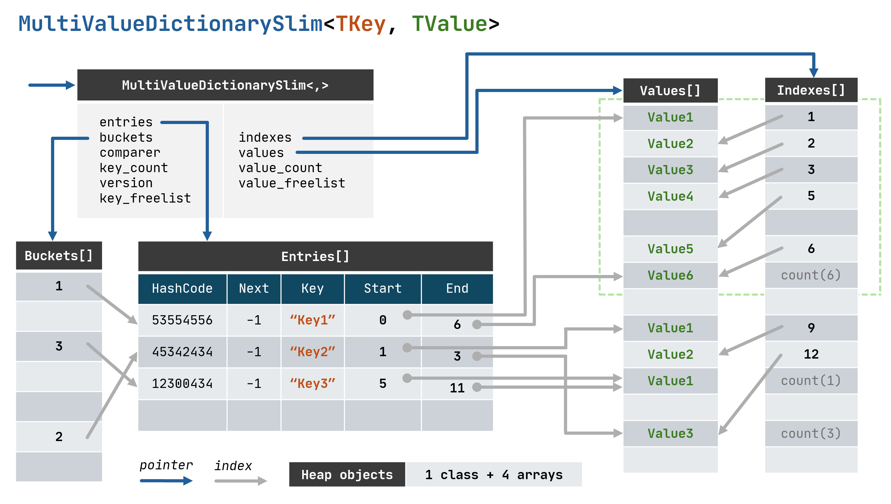
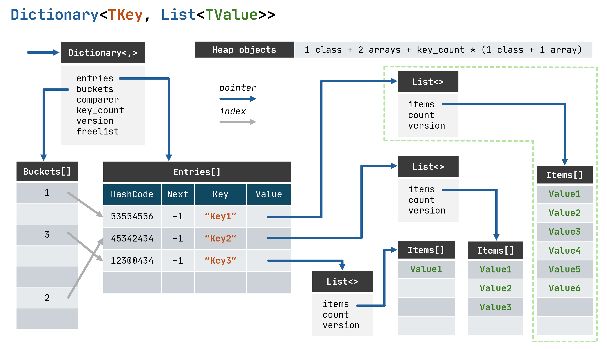

# `MultiValueDictionarySlim` collection

This repo consists the implementation of the multi-map data structure - a dictionary that maps a single key to multiple values. In .NET there is no such data structure available in the BCL, except there is a `ILookup` interface and `.ToLookup()` that represents the same concept, but do not expose the multi-map data structure.

now obsolete `MultiValueDictionary`.

`ILookup`

## Memory layout

Let's compare the data structure memory layout using the `Dictionary<TKey, List<TValue>>` for comparison:

The biggest advantage of the `MultiValueDictionarySlim<TKey, TValue>` memory layout is that the amount of retained heap objects count is not dependent on the amount of keys and values stored in the data structure:

## Trade-offs

* Unlike with `Dictionary<TKey, List<TValue>>` there is no way to get a reference to the collection values for some specific key, and use it separately - as a standalone

* The keys without the values are not stored.